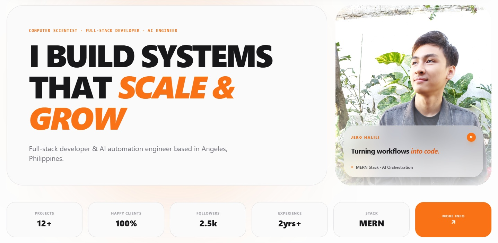

# Jero Halili | Portfolio

### **Computer Scientist • Full-Stack Developer • AI Engineer**
**Turning workflows into code.** Modern portfolio showcasing full-stack development, database management, and AI automation projects with scalable, real-world impact.

**Live Site:** [https://jerohalili.github.io/](https://jerohalili.github.io/)

---

## Tech Stack & Language Distribution

This site is a high-performance, content-driven application built with **Astro**.

* **Framework:** Astro
* **Language:** TypeScript — Strictly typed for reliability
* **Styling:** Tailwind CSS
* **Scripts:** JavaScript
* **Deployment:** GitHub Pages

---

## Key Projects

### **Automated AI Marketing System**
A fully automated marketing pipeline that generates posts using local LLMs, creates images, and publishes directly to social media.

### **PBSI Digital Transformation**
Led the transition for Presbyterian Bible Seminary Inc., moving manual record systems to a fully digital database setup.

### **Astro Portfolio**
A high-performance portfolio featuring a custom theme-memory system that defaults to light mode for accessibility while remembering user preferences.
---

## Local Development
To run this project locally, follow these commands:

### Clone the repository
git clone [https://github.com/jerohalili/jerohalili.github.io.git](https://github.com/jerohalili/jerohalili.github.io.git)

### Enter the directory
cd jerohalili.github.io

### Install dependencies
npm install

### Start the development server
npm run dev

## Certifications & Experience

* **AWS Academy Graduate** - Cloud Foundations (Feb 2026)
* **Responsive Web Design** - freeCodeCamp (Sep 2024)
* **Social Media Marketing Manager** - Technobyte (2025–Present)
* **Database Administrator** - PBSI (2024–2025)

---

## Getting Started

To set up the project locally, run the following commands:
git clone [https://github.com/jerohalili/jerohalili.github.io.git](https://github.com/jerohalili/jerohalili.github.io.git) && cd jerohalili.github.io && npm install && npm run dev

## Connect With Me
* **LinkedIn:** www.linkedin.com/in/jero-halili-bb385b295
* **Email:** jerobusiness20@gmail.com
